# Tidings — the complete guide

Tidings is a letter-writing app. You pick real paper, write on it, dress it with
stickers and a photograph, and seal it in an envelope for your reader to open.

**Live app:** https://tidings-letters.vercel.app
**Code:** https://github.com/Usman9374/Tidings

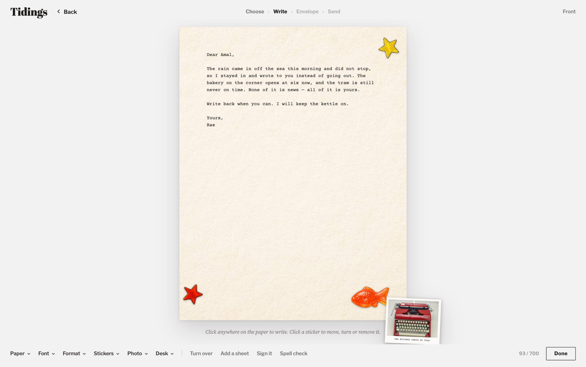

### Before you start

| | |
|---|---|
| **Browser** | A current Chrome, Edge or Safari. Older Firefox cannot type on the paper. |
| **Window** | Desktop-sized. It works down to about 900 × 600 and is not built for phones. |
| **Saving** | Nothing is saved. A refresh loses the letter — see [§13](#13-things-to-know-before-you-rely-on-it). |
| **Account** | None needed. Open the link and write. |

---

## Contents

1. [What Tidings is](#1-what-tidings-is)
2. [Who it's for](#2-who-its-for)
3. [The two-minute tour](#3-the-two-minute-tour)
4. [The bar across the top](#4-the-bar-across-the-top)
5. [Screen 1 — where you start](#5-screen-1--where-you-start)
6. [Screen 2 — what you write on](#6-screen-2--what-you-write-on)
7. [Screen 3 — writing](#7-screen-3--writing)
8. [The six drawers](#8-the-six-drawers)
9. [Moving things around](#9-moving-things-around)
10. [Screen 4 — the envelope](#10-screen-4--the-envelope)
11. [Screen 5 — as your reader sees it](#11-screen-5--as-your-reader-sees-it)
12. [Screens 6 and 7 — the typewriter](#12-screens-6-and-7--the-typewriter)
13. [Things to know before you rely on it](#13-things-to-know-before-you-rely-on-it)
14. [Everything in the drawers](#14-everything-in-the-drawers)
15. [Toolbar reference](#15-toolbar-reference)
16. [Mouse and keyboard](#16-mouse-and-keyboard)
17. [For developers](#17-for-developers)
18. [Adding new stationery](#18-adding-new-stationery)
19. [Building and deploying](#19-building-and-deploying)
20. [Troubleshooting](#20-troubleshooting)

---

## 1. What Tidings is

Tidings is a single web page that behaves like a stationery drawer.

Most writing apps give you a blank rectangle and a font menu. Tidings gives you
photographs of real things — a sheet of ruled star paper, an open green
notebook, a burgundy portable typewriter, a wax seal, a goldfish sticker — and
lets you write on them.

Three ideas hold it together:

**The paper is a real photograph, and the writing lands on its real lines.**
Every sheet in the app was measured: where its printed rules sit, how far in its
margins go, how big the writing should be. When you type on the school page, the
words sit on the rules that were photographed there. Change the font and the app
re-measures that font's shape and nudges the text so the baseline still lands on
the line.

**Everything you place is a real cut-out.** The stars, the wax seals, the
charms, the goldfish — all photographs cut out to a transparent edge, not drawn
icons. When one sits on your letter it casts its own shadow in its own
silhouette.

**It's one flowing letter, not a form.** You click anywhere on the paper and
start writing there. You turn the sheet over and write on the back. You add
another sheet. Nothing is a text box.

There are two ways in: write by hand, or use the typewriter. They join in one
direction — anything you type on a machine can be carried over and finished as a
letter.

---

## 2. Who it's for

**Someone writing to one person.** A birthday letter, a thank-you, a long
overdue catch-up, a note to someone who has moved away. The whole app is built
around one letter going to one reader.

**Someone who wants it to look like something.** The point of Tidings is that
the thing you make has been *chosen* — this paper, this hand, this seal — rather
than typed into a message box.

**Someone keeping a diary.** Most of the diary books are a full two-page spread
of a real notebook, and a diary doesn't go in an envelope.

**Someone who likes typewriters.** The typewriter path is its own small toy:
eight machines, and the key you press lights up on the one you picked.

It is **not** a word processor, not a mail client, and not a team tool. There
are no accounts, no folders and no collaborators. One person, one letter, one
sitting.

---

## 3. The two-minute tour

**Tidings opens with a sample letter already in it** — a note to "Amal" signed
"Rae", with a P.S. on the back, three stickers and a polaroid. Nothing is blank
when you arrive, which is why the counter already reads `133 / 700` and the
toolbar already says "Sheet full — add another" on some papers.

To start your own letter, click the paper, select it all with **Ctrl+A**
(**Cmd+A** on a Mac) and type over it. That clears the front. The back still has
the P.S. on it — **Turn over** and clear that too.

Then:

1. Open the app. Choose **Write a letter**.
2. Choose **Letter**.
3. Clear the sample and type your own.
4. Open **Paper** and pick a different sheet. The writing re-flows onto it.
5. Open **Stickers**, pick a tray, click a star. It lands on the paper — drag it
   where you want it.
6. Press **Done**, pick an envelope, write a name on it.
7. Press **Send it** and click the envelope to open it, the way your reader
   would.

That's the whole app. Everything below is detail.

---

## 4. The bar across the top

The same four things sit at the top of nearly every screen.

| Part | What it does |
|---|---|
| **Tidings** | The wordmark, top-left. Always a way home to the first screen. |
| **‹ Back** | One step back. Absent on the first screen, because there is nowhere to go. |
| The step trail | `Choose › Write › Envelope › Send`, or `Type › Preview` on the typewriter. The current step is bold; finished steps are clickable; steps still ahead are dimmed and inert. |
| The status | Top-right. Reads **Front** or **Back** while you write and **As your reader sees it** on the send screen. Blank elsewhere. |

Two things to know. The **Envelope** step only appears for a letter or a
postcard — a diary's trail reads `Choose › Write › Send`. And the step trail
hides itself entirely on windows 820 pixels wide or narrower; Back still works.

Browser Back and Forward walk the screens too.

---

## 5. Screen 1 — where you start

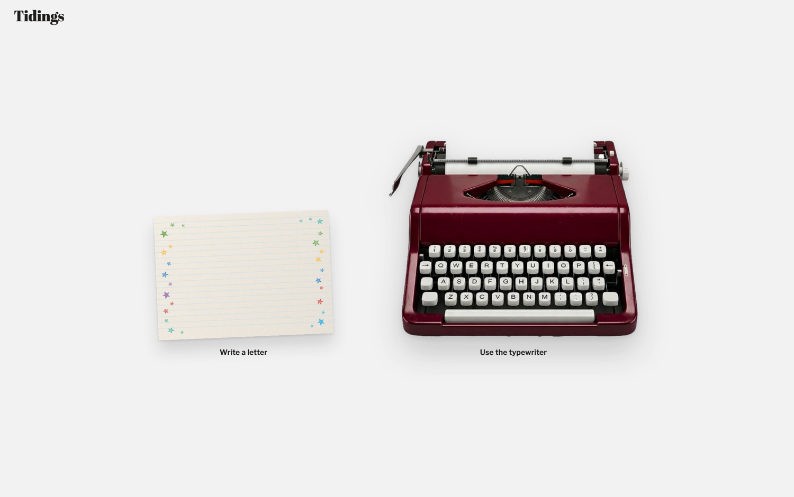

Two things rest on the desk.

| Choice | What it does |
|---|---|
| **Write a letter** | Goes to screen 2, where you pick what to write on |
| **Use the typewriter** | Goes straight to the typewriter (screen 6) |

---

## 6. Screen 2 — what you write on

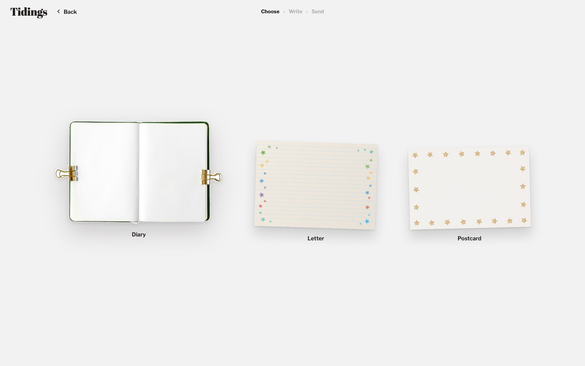

Three objects, and each one is a picture of the paper you'll actually get.

| Choice | What you get | Goes in an envelope? |
|---|---|---|
| **Diary** | A notebook — six of its nine books are open two-page spreads, three are single pages | No |
| **Letter** | A single sheet, front and back | Yes |
| **Postcard** | A card with a writing half and an address half | Yes |

Pick one and you land straight on the writing screen, already set to that very
paper. You can change it at any time from the **Paper** menu.

Choosing a different one later doesn't wipe your writing — the words, stickers
and photograph carry across.

---

## 7. Screen 3 — writing

This is the screen you will spend your time on: the paper in the middle, six
drawers and a row of words along the bottom.

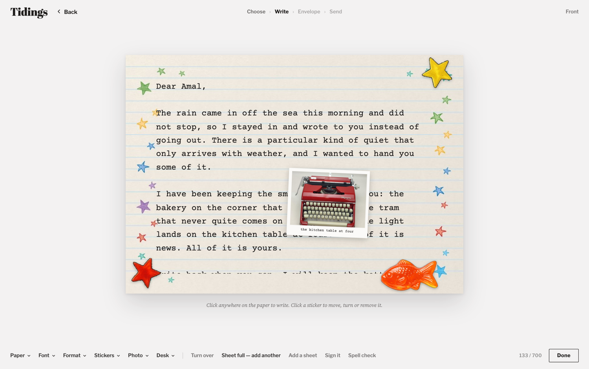

### Clicking and typing

Click anywhere on the paper and type. If you click past the end of what you've
written, the app types in the line breaks and spaces needed to get there, so
your writing starts where you clicked and the letter stays one continuous piece
of text. One undo removes the padding.

### The word count

The counter in the bottom-right reads something like `133 / 700`. That's the
whole letter — every sheet, both sides — against a limit of 700 words. The limit
is hard: at 700, new words are refused as you type and pasted text is trimmed to
fit. Nothing you have already written is deleted.

### Turning the sheet over

**Turn over** takes you to the back of the current sheet. The button reads
**Write on the back** until there is something there, then it reads **Turn
over**. (Because the sample letter has a P.S. on its back, it reads "Turn over"
from the moment you arrive.)

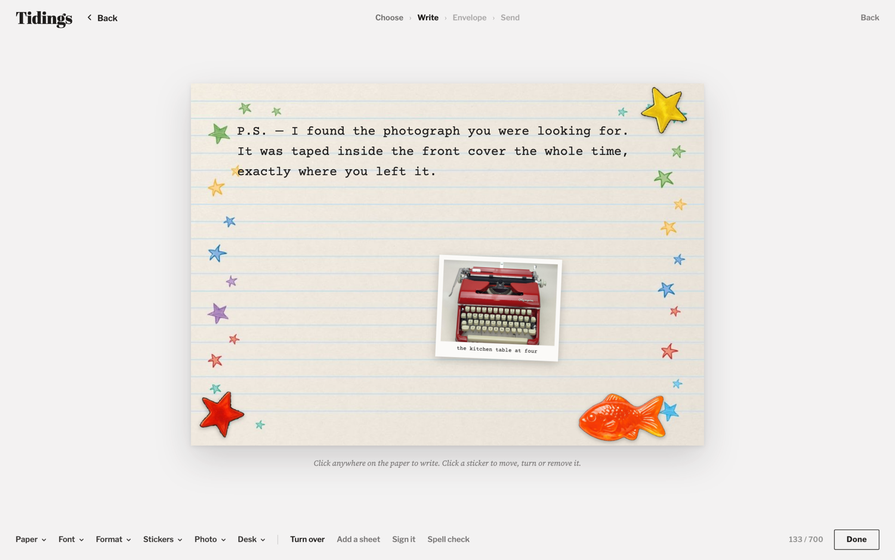

### More than one sheet

**Add a sheet** puts a fresh sheet on the stack and turns to it. Once there's
more than one, a pager appears in the top-right: `‹ Sheet 2 of 2 ›`.

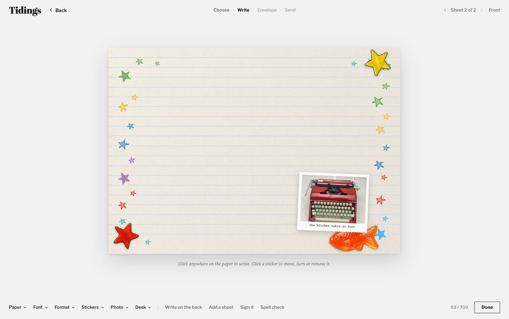

If your writing runs off the bottom of the sheet, a new button appears in the
toolbar: **Sheet full — add another**. It isn't triggered by the word count —
the app measures the actual writing against the actual paper after every
keystroke. On a tall sheet you can reach 700 words without ever seeing it; on a
small card it shows up much sooner.

> **Note:** all the sheets share the same 700-word budget. Adding a sheet gives
> you more paper, not more words. The writing that overflowed is hidden, not
> moved — **Add a sheet** gives you a blank one.

### The diary

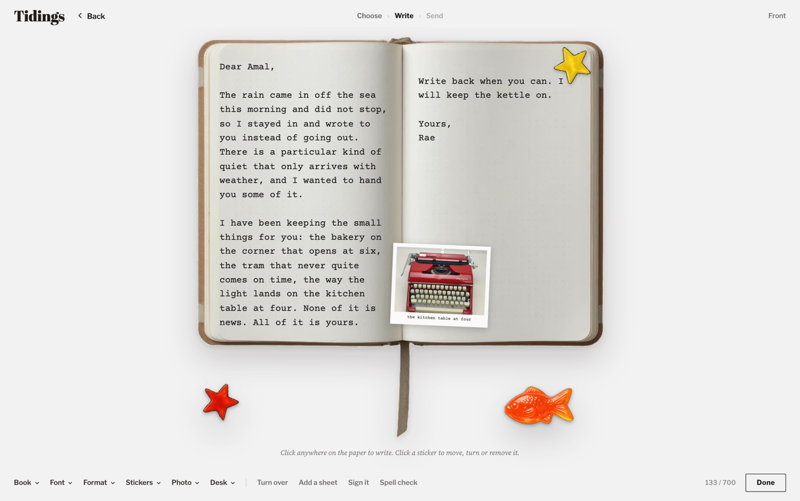

Six of the nine books — dot grid, dot grid ruled, lined, cream ruled, vintage
and green book — are open notebooks, and your writing flows across both pages as
two columns. Because the writing runs in columns, a full page fills off the
right-hand edge rather than the bottom; the app watches both directions, so it
catches either. The other three — red spiral, spiral pad and clipboard — give
you one writing page in a single column.

One small thing changes for a diary: the **Paper** drawer is called **Book**.

### The postcard

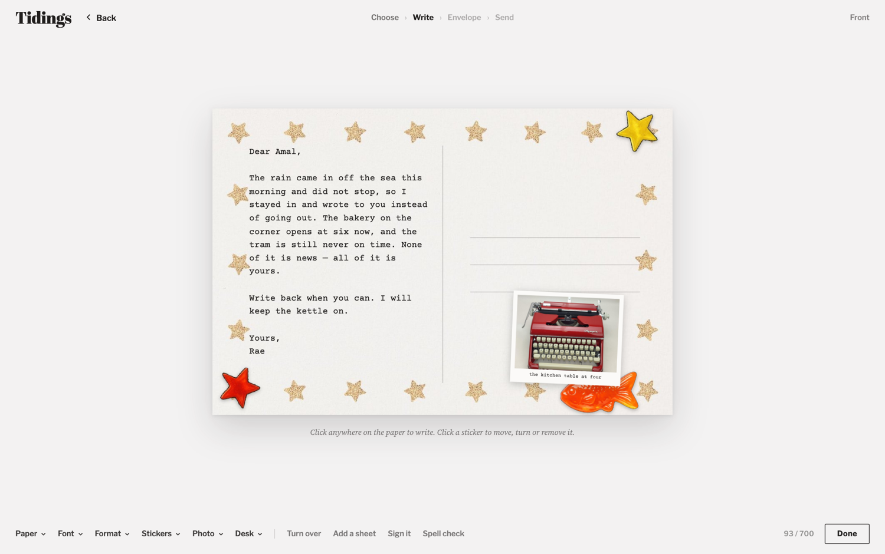

A postcard is split down the middle: you write on the left, and the right has
three address lines you can click into and type on (60 characters each).
Clicking anywhere on the right-hand side jumps to the nearest address line
instead of typing on the card.

---

## 8. The six drawers

Every drawer opens upward over the desk and closes when you pick something,
press Escape, or click away.

### Paper

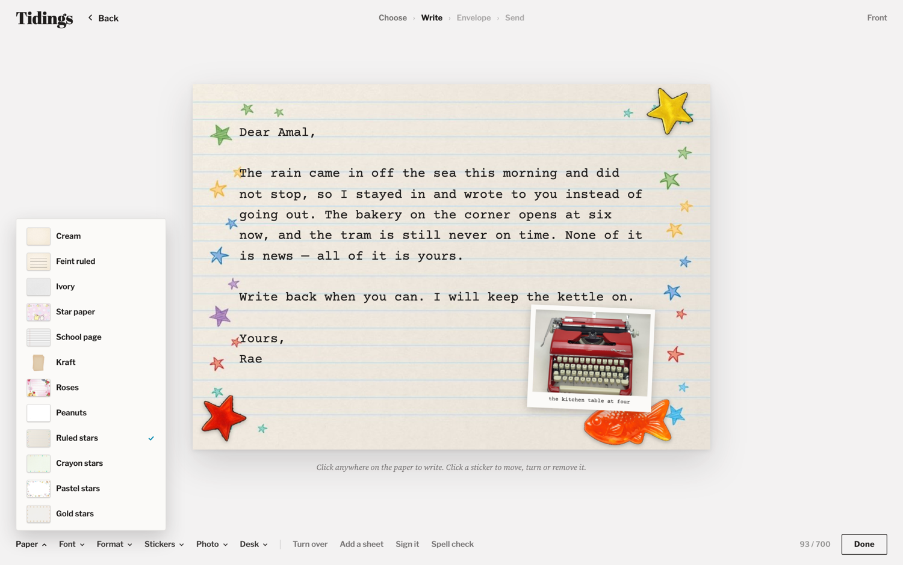

Every paper in the drawer is a photograph. Pick one and your writing re-flows
onto it at that paper's own size, on that paper's own rules.

The list changes with what you're writing: **18** letter papers, **9** diary
books, **11** postcards.

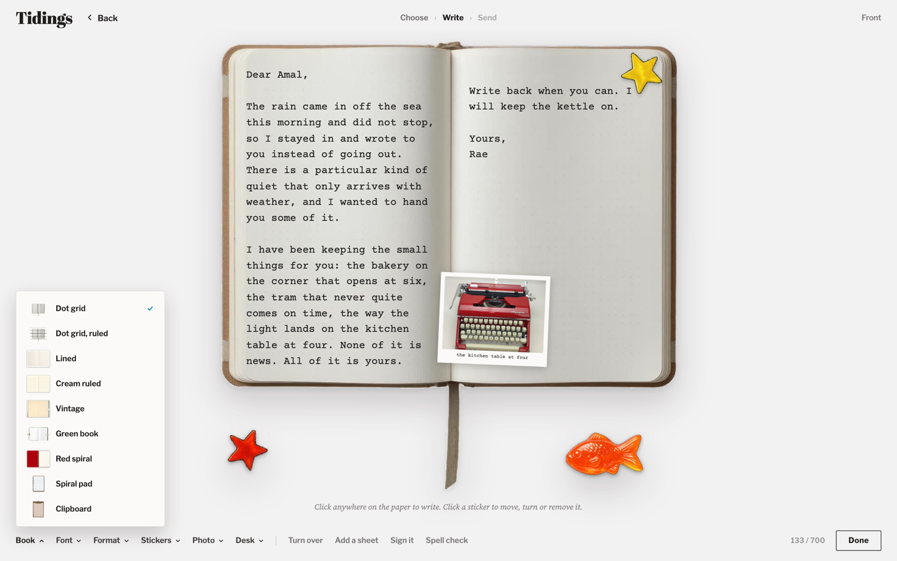

### Font

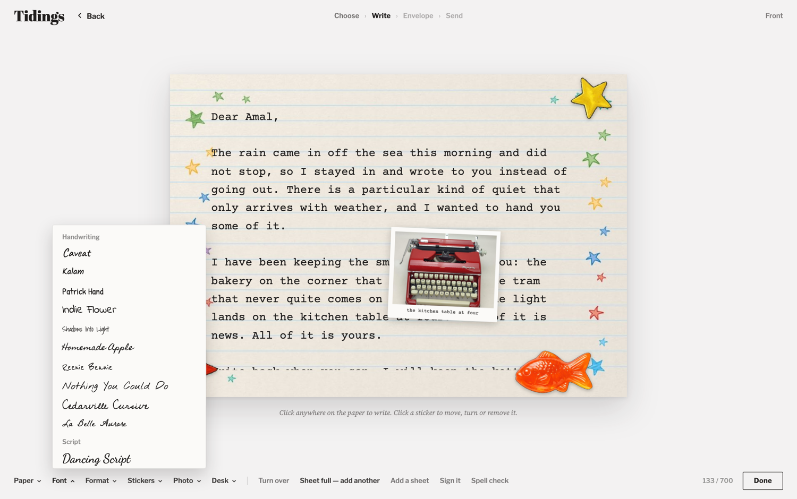

**40 fonts**, in five groups, each previewed in itself:

| Group | How many | Examples |
|---|---|---|
| Handwriting | 10 | Caveat, Kalam, Indie Flower, Homemade Apple |
| Script | 10 | Great Vibes, Parisienne, Sacramento, Tangerine |
| Serif | 10 | EB Garamond, Libre Baskerville, Playfair Display |
| Typewriter | 5 | Courier Prime (the default), Special Elite, Space Mono |
| Sans | 5 | Josefin Sans, Quicksand, Nunito, Libre Franklin |

Fonts differ in how tall their letters are and where the baseline sits inside a
line. Tidings measures each one against Courier Prime when you pick it and
adjusts the size and the vertical position, so whichever hand you choose, the
writing still sits on the paper's printed rules.

Choosing a font takes a beat: the drawer closes at once and the letter restyles
a moment later, once that font's files have loaded.

### Format

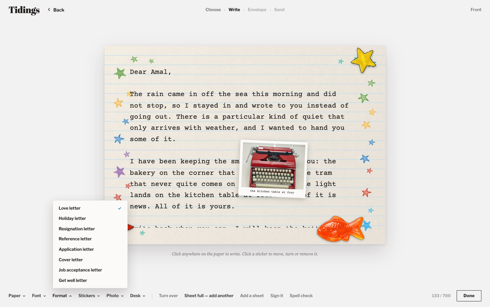

Eight letter skeletons to start from:

love letter · holiday letter · resignation letter · reference letter ·
application letter · cover letter · job acceptance letter · get well letter

> **Warning:** picking a format **replaces all the writing on the current side**
> with the skeleton — and that includes picking the format already ticked, which
> starts it over. Ctrl/Cmd+Z undoes it.

### Stickers

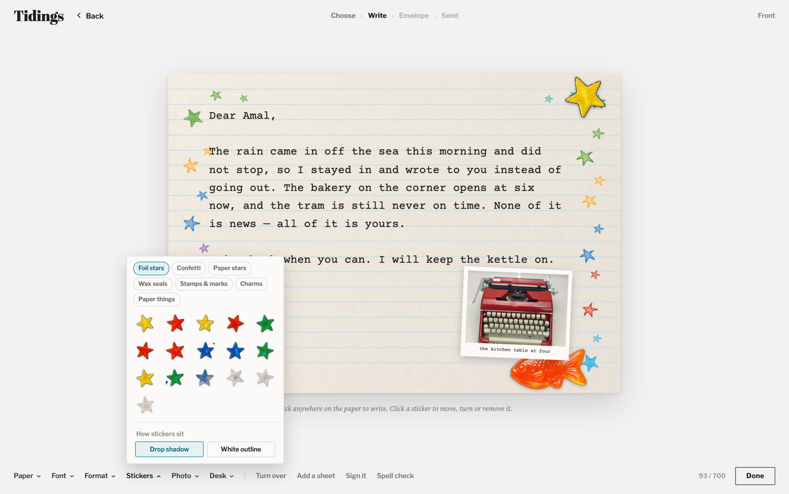

**115 cut-outs** in seven trays. Click a tray to open it, click a cut-out to put
it on the paper.

| Tray | How many |
|---|---|
| Foil stars | 16 |
| Confetti | 22 |
| Paper stars | 14 |
| Wax seals | 18 |
| Stamps & marks | 14 |
| Charms | 27 |
| Paper things | 4 |

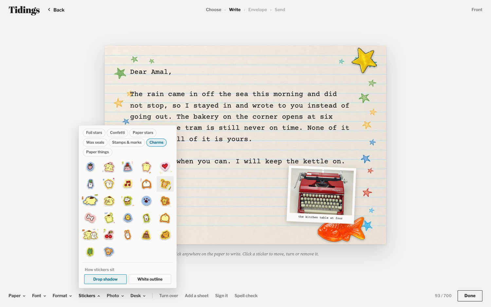

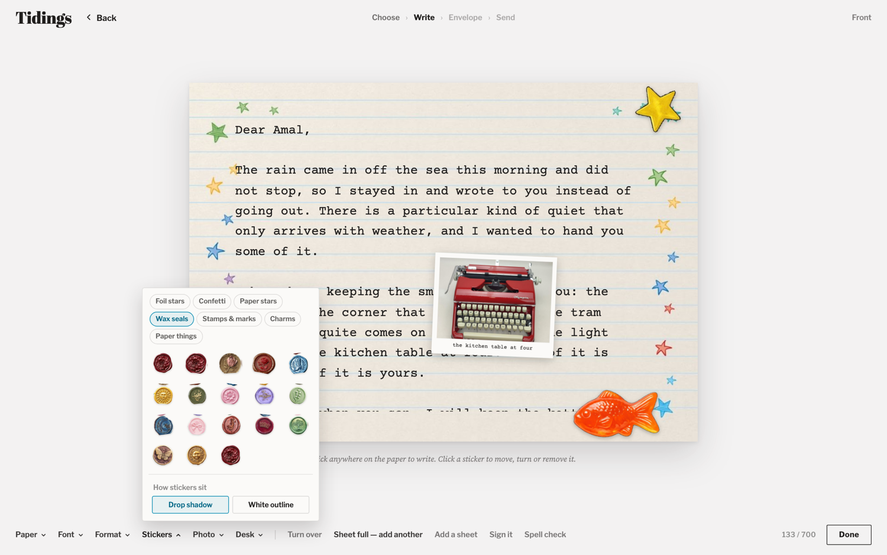

There is no limit on how many you can add, and you can add the same one more
than once. Each new sticker lands near the middle of the sheet at a small random
tilt, so if you add several without moving them they will pile up on each other.

At the bottom of the tray, **How stickers sit** switches every sticker between
two looks:

- **Drop shadow** — the cut-out casts a soft shadow in its own shape
- **White outline** — a white edge around the cut-out, like a die-cut sticker

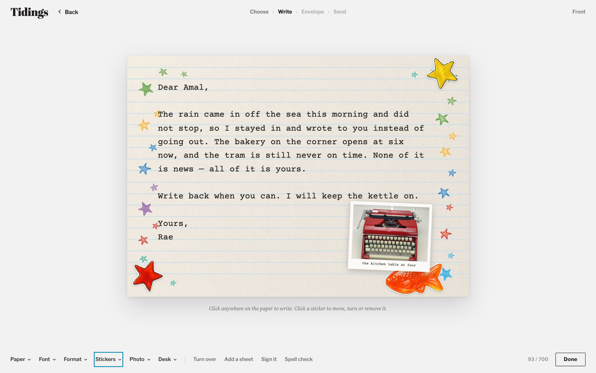

### Photo

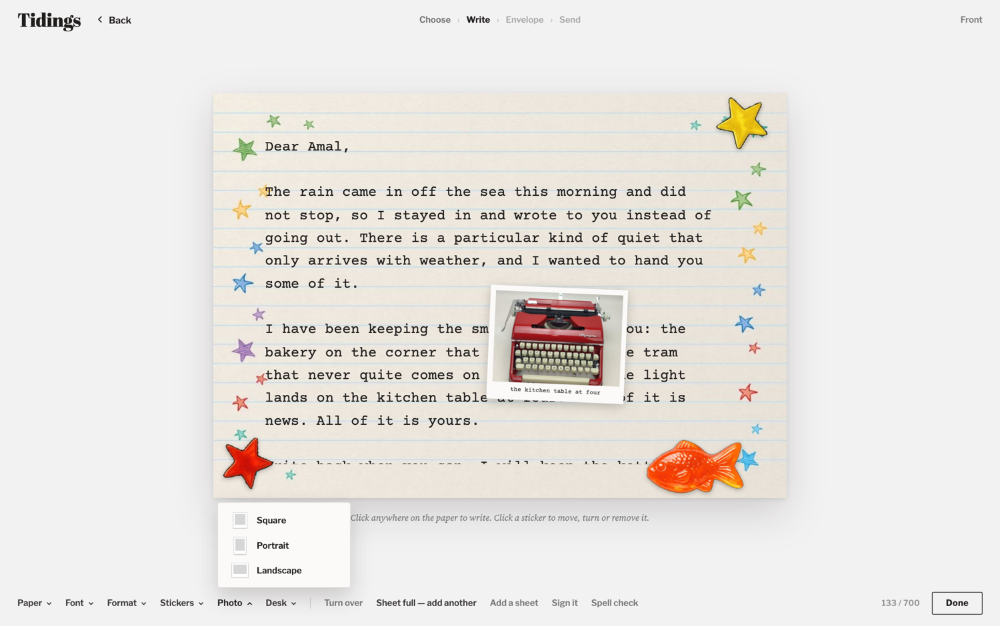

Adds an empty polaroid frame in **Square**, **Portrait** or **Landscape**. Like
stickers, there is no limit — but every new frame lands in the same spot, so add
one, move it, then add the next.

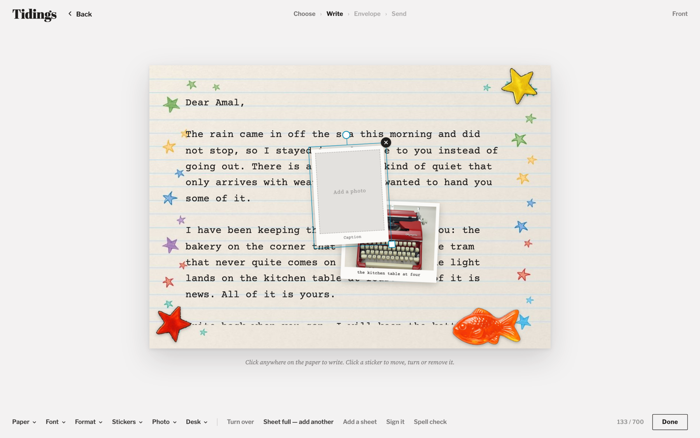

Click the empty frame to pick a picture, or drag one onto it from your desktop.
Type under it for a caption (30 characters). Once it holds a picture, clicking
no longer opens the picker — select the frame and use **Replace photo**, or drag
a new picture straight on top.

### Sign it

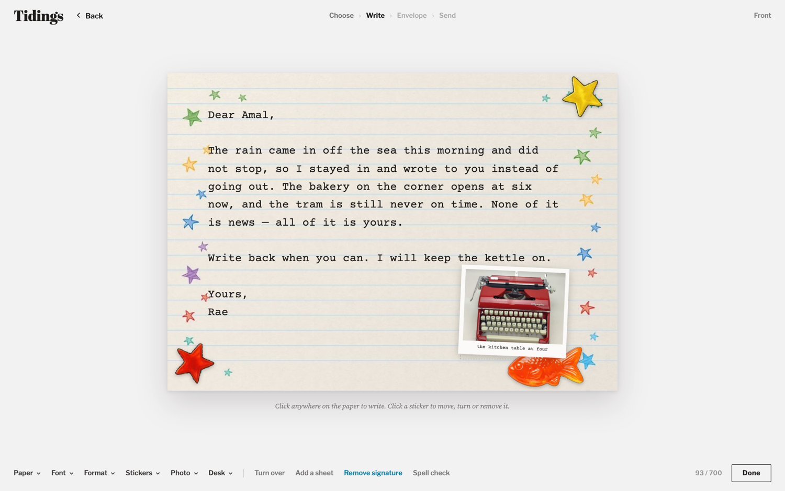

**Sign it** puts a slot in the bottom-right corner of the sheet. Click it or
drop a picture on it. It sits on the paper in multiply blend, so a signature
photographed on white paper looks like ink rather than a pasted-on rectangle.

**Remove signature** hides the slot. Your picture is kept — turning it back on
brings the same signature back. The signature can't be moved, turned or resized.

### Desk

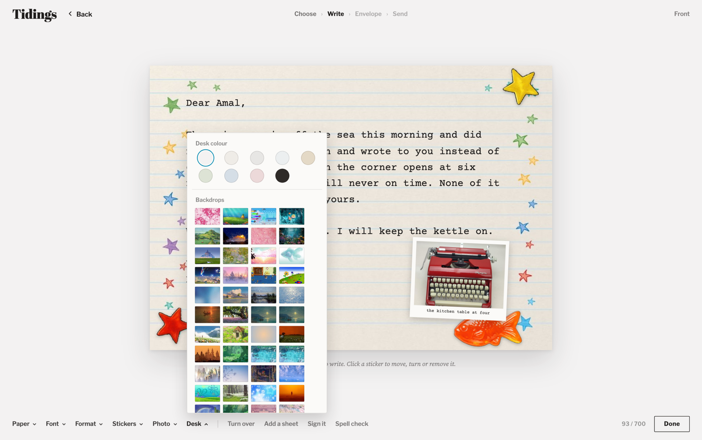

Four ways to change what your paper is lying on:

1. **Desk colour** — nine flat tones
2. **Backdrops** — 47 pictures
3. **Your own** — a picture from your computer, at least 1280 × 720 on its long
   and short side. Anything smaller is refused, with a note in the drawer telling
   you the size you offered.
4. **Custom colour** — a colour wheel with a brightness slider

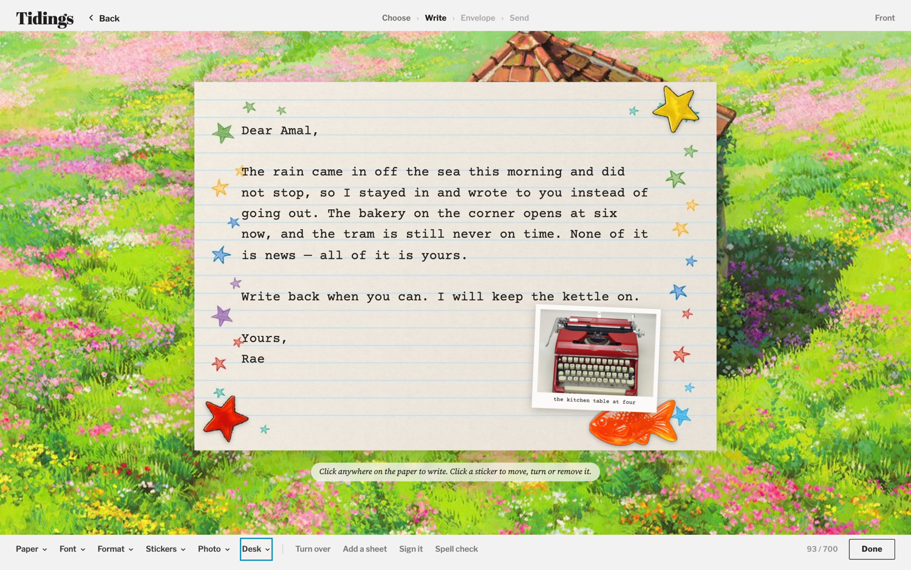

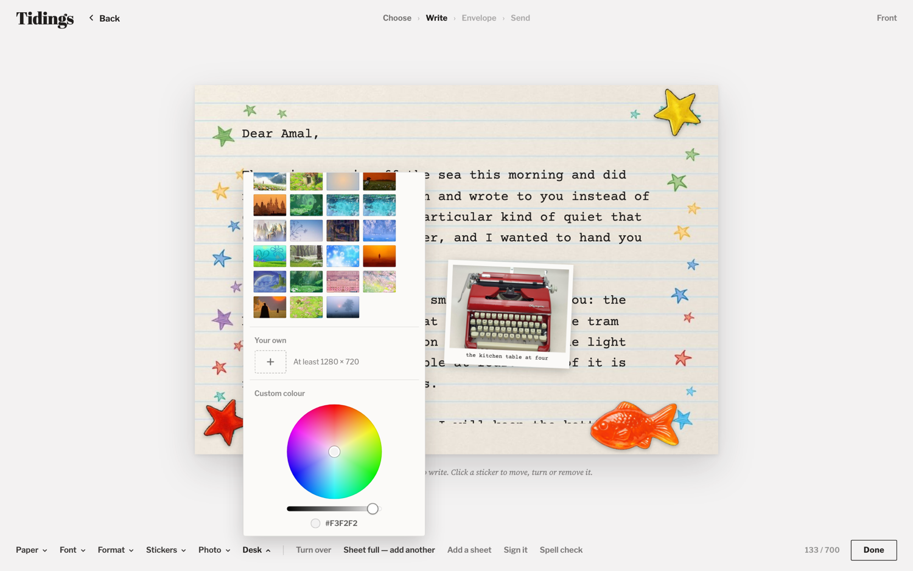

The app works out how dark the picture is and switches its own text between dark
and light so it stays readable. Over a picture, the line of advice under the
paper gets a pale rounded panel behind it so it doesn't disappear into the
background.

The desk you choose belongs to the writing screens. Go back to the chooser or
over to the typewriter and it's gone; come back and it's there again.

### Spell check

Turns the browser's own spell checking on and off for the letter, the postcard
address lines and the envelope address. It's one shared setting across the whole
app.

---

## 9. Moving things around

Click a sticker or a photograph on the paper to select it.

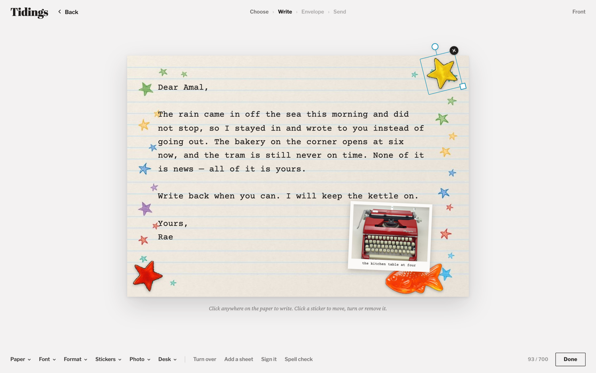

| Handle | What it does |
|---|---|
| The object itself | Drag to move it |
| The knob above it | Drag to turn it. Hold **Shift** to snap to 15° |
| The corner square | Drag to resize, between 0.4× and 3× |
| The **×** | Remove it |

Pressing **Delete** or **Backspace** also removes a selected object. **Escape**
deselects. Clicking anywhere else on the desk deselects too.

Selecting an object brings it to the front, and it stays there. Releasing the
turn knob within three degrees of upright snaps it exactly upright.

> **No undo here.** Ctrl/Cmd+Z undoes typing, not object changes. Removing a
> sticker or a photograph is final.

---

## 10. Screen 4 — the envelope

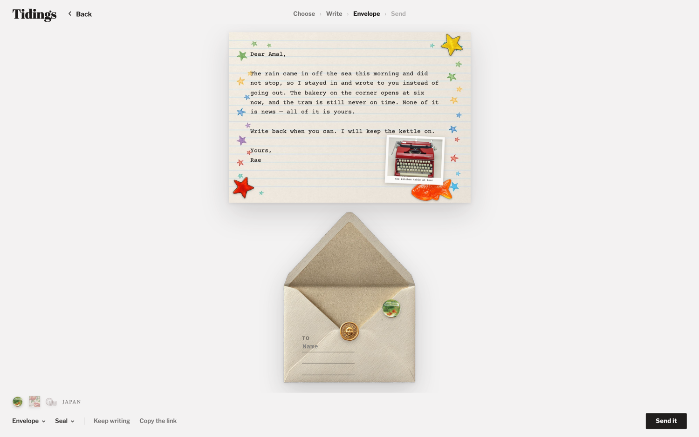

Letters and postcards get this screen. Diaries skip it — a diary isn't posted.

### Choosing an envelope

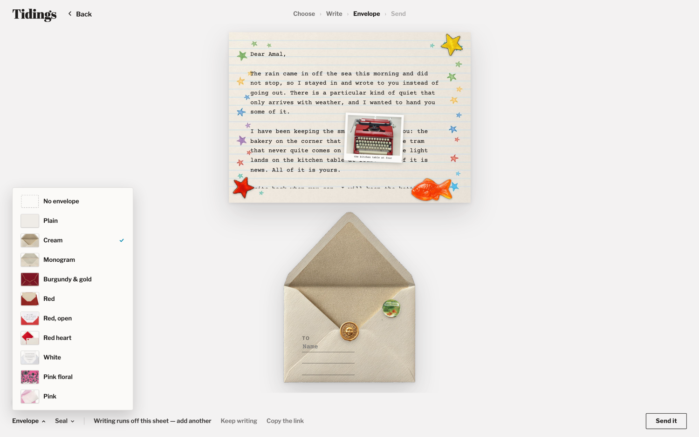

Ten envelopes, plus **No envelope** at the top of the list.

| Envelope | What it is | Address block? |
|---|---|---|
| Plain | A coloured rectangle with a drawn flap — the only one you can recolour | Yes |
| Cream | An open cream envelope | Yes |
| Burgundy & gold | A deep burgundy envelope with gold edging | Yes |
| Monogram | A cream envelope with a monogram | No |
| White | A white card envelope | No |
| Red | A red card envelope | No |
| Red, open | A red envelope with the flap open | No |
| Red heart | A cream envelope with a red heart | No |
| Pink floral | A pink floral envelope | No |
| Pink | A pink envelope | No |

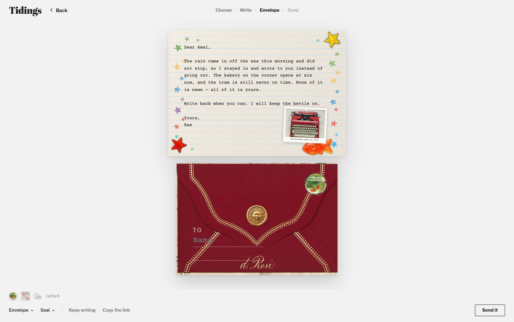

Picking **No envelope** leaves the letter without one: this screen shows just
the card, and the send screen shows the letter straight away with nothing to
open. The whole envelope row disappears and so does the Seal drawer.

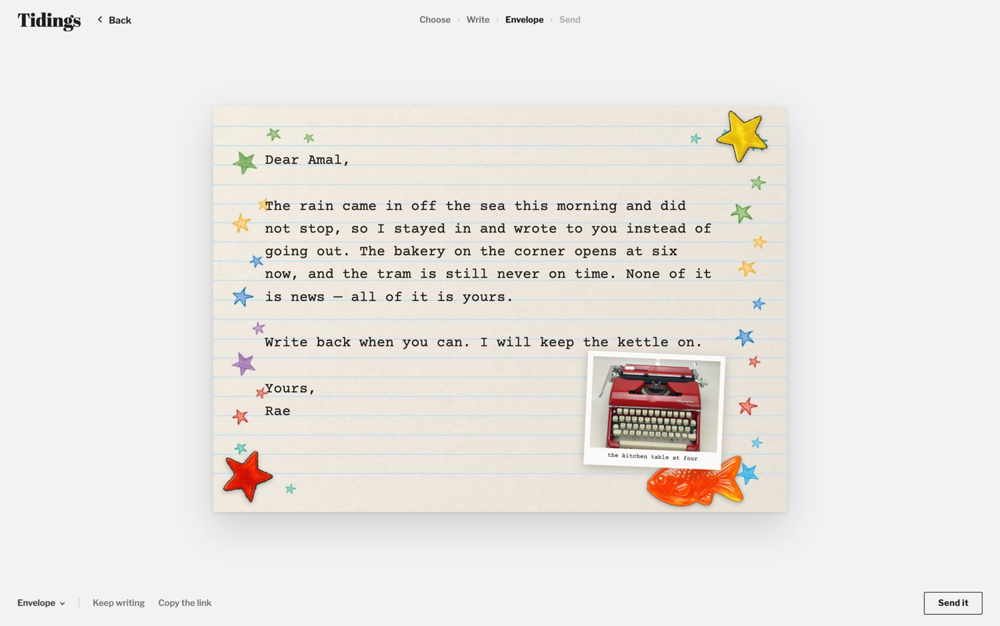

### Addressing it

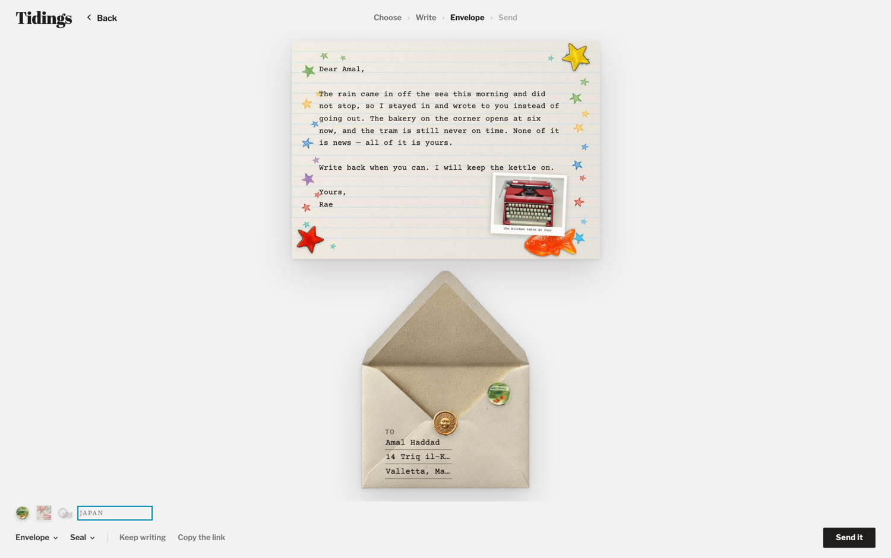

Three of the ten — **Plain**, **Cream** and **Burgundy & gold** — have a **To**
block you can type in. Three lines, 40 characters each, written in the same hand
as your letter. You can only type on this screen; on the send screen it is
display-only.

The other seven are photographs with no clear space to write on, so they show no
address block. Anything you typed is kept — pick an envelope that has a block
and it's still there.

### The seal

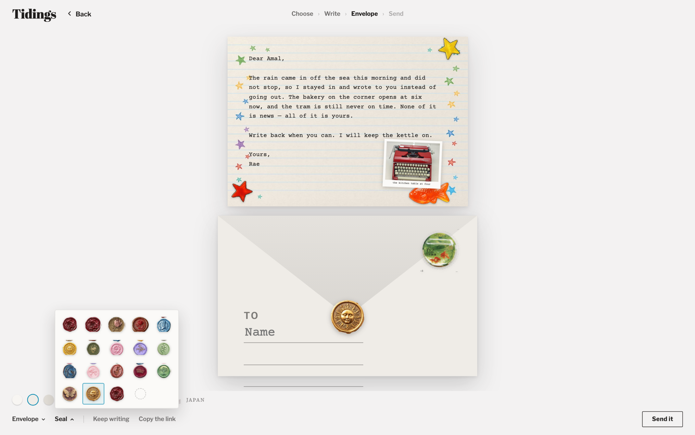

Eighteen wax seals — roses, a moon, a moth, a boot, a saturn, a crown — plus **No
seal** as the last tile.

### Colour, stamp and country

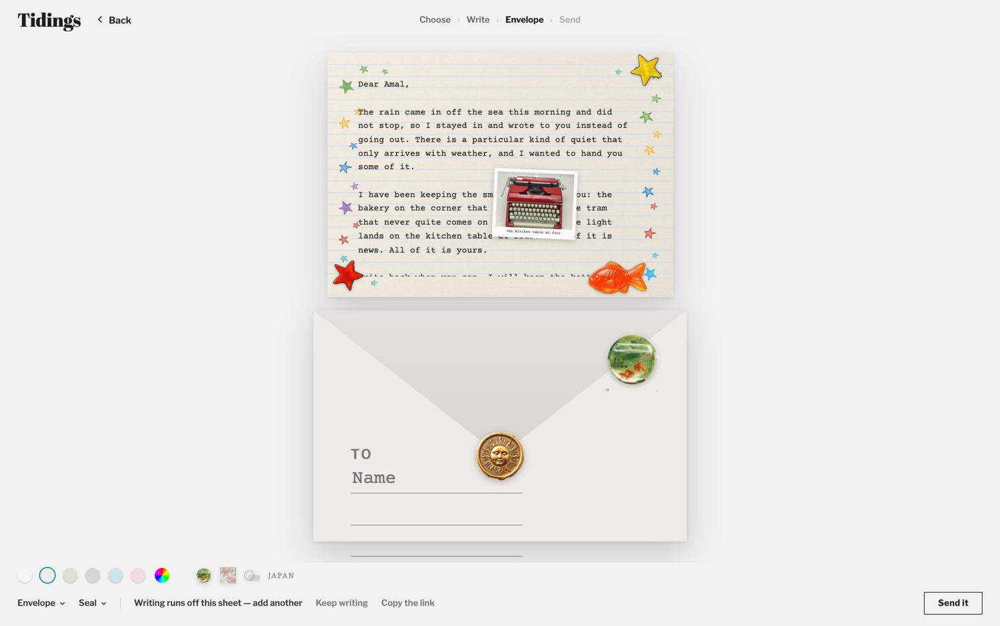

The row above the toolbar carries:

- **Six colour dots and a colour wheel** — only for the **Plain** envelope, which
  is the one drawn rather than photographed. There is nothing to recolour on the
  other nine.
- **Three stamps**, which change with the country
- **A country** — Japan, Malta, Pakistan or the United Kingdom

Each country offers two postage stamps and one postal mark. Switching country
resets the stamp to the first one. There is no way to send without a stamp.

---

## 11. Screen 5 — as your reader sees it

This is the letter as it arrives.

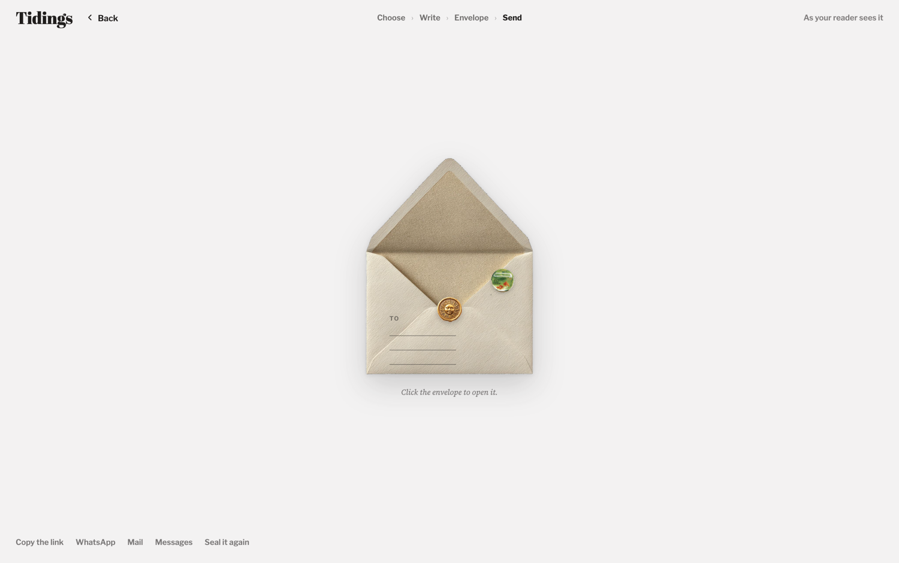

The envelope sits there with its stamp and its wax seal, and a line underneath
says *Click the envelope to open it.*

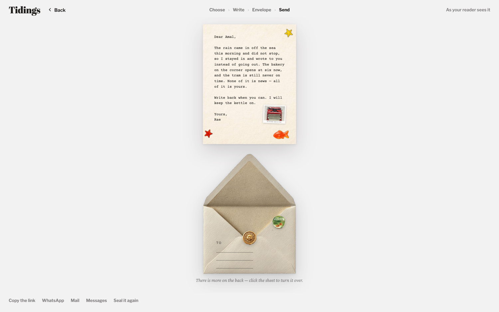

The letter appears above the envelope. If you wrote on the back, a line appears:
*There is more on the back — click the sheet to turn it over.*

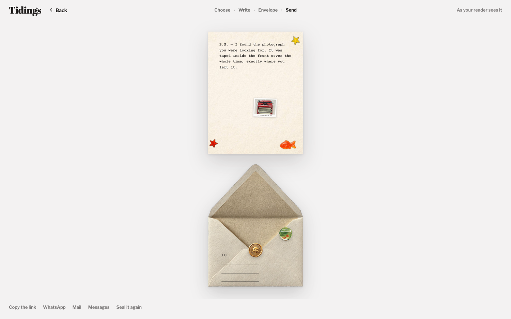

Along the bottom: **Copy the link**, **WhatsApp**, **Mail**, **Messages**, and
**Seal it again** to close the envelope and start the arrival over.

> All four of those words do the same thing: they copy one and the same fixed
> address to your clipboard. None of them opens WhatsApp, Mail or Messages, and
> the address is identical for every letter. This screen is the letter as your
> reader would see it, shown on your own machine.

---

## 12. Screens 6 and 7 — the typewriter


A sheet is wound into the platen, and the machine covers the sheet's bottom
edge so the paper looks fed out of the roller. Type, and the words appear on the
paper.

**Click the paper first.** Nothing has the keyboard when you arrive, so your
first keystrokes light up the keys without typing anything.

### The keys light up

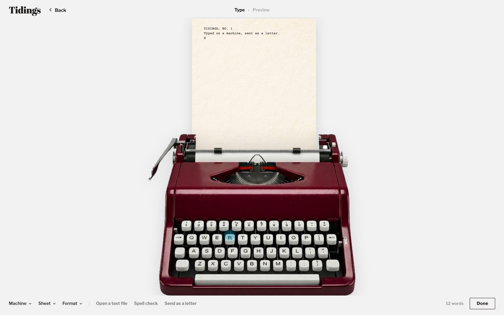

Every machine's keyboard was measured off its own photograph, so the key that
lights is the real key on that real machine.

Each machine only knows its own keys. On **the omont** only Q W E R T Y U I O P
A S and the space bar light up — its other keys weren't in the photograph. On
**the night machine** there's no `1` and no comma; it has `;` and `?` instead.
**The olympia** and **the studio olympia** are German layouts, so Z and Y are
swapped. Keys that don't light still type perfectly normally.

### Machine

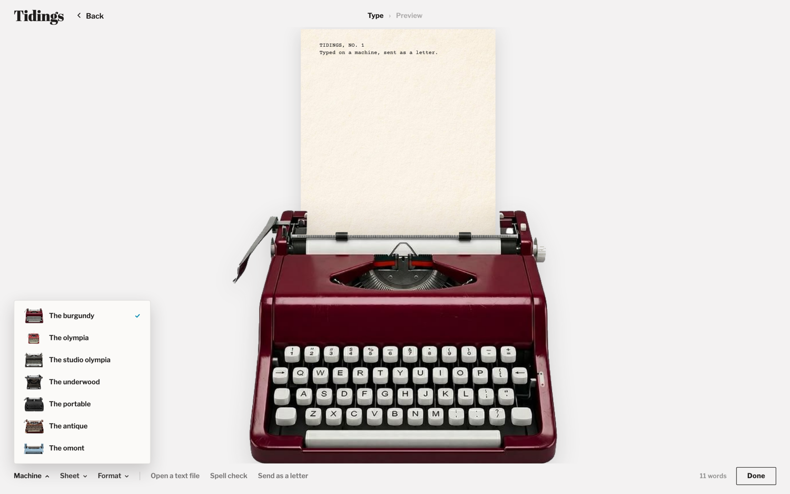

Eight machines: the burgundy · the olympia · the studio olympia · the underwood ·
the portable · the antique · the omont · the night machine

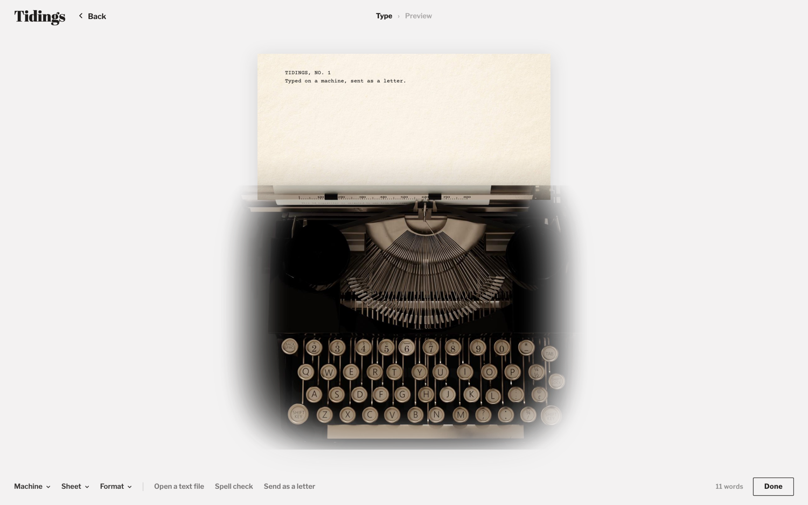

### Sheet

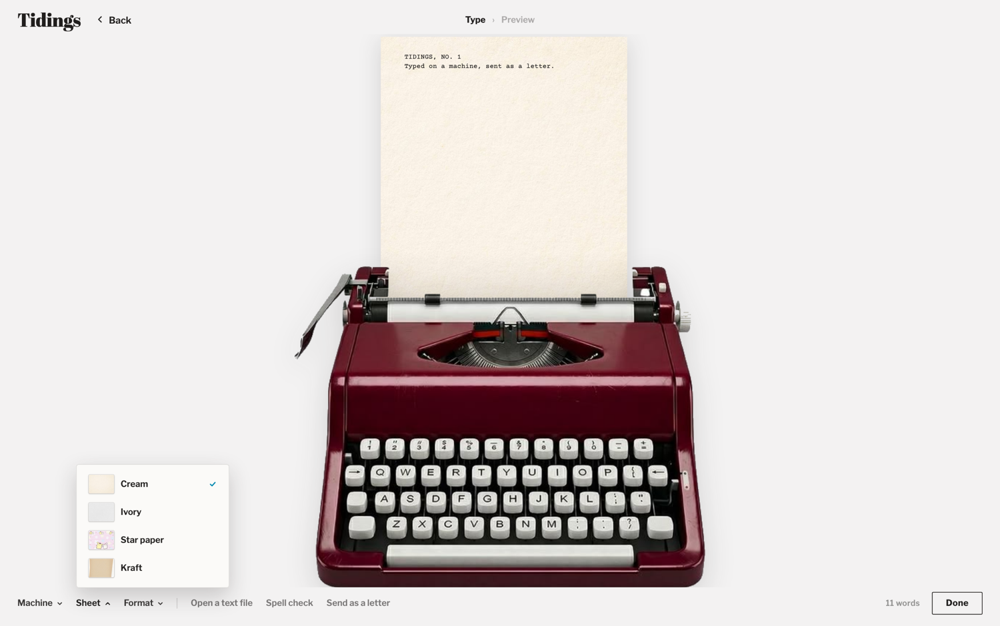

What's wound into the platen: **Cream**, **Ivory**, **Star paper** or **Kraft**.
The sheet is cropped to that machine's own paper shape, so the same cream page is
a tall portrait on six of the eight machines, a slightly wide band on the olympia
and a full 2:1 band on the night machine.

### Open a text file

Loads a `.txt` or `.md` file onto the paper. It **replaces** whatever is there,
and only the first 4,000 characters are kept — with no warning if the file was
longer.

### Screen 7 — the typed page

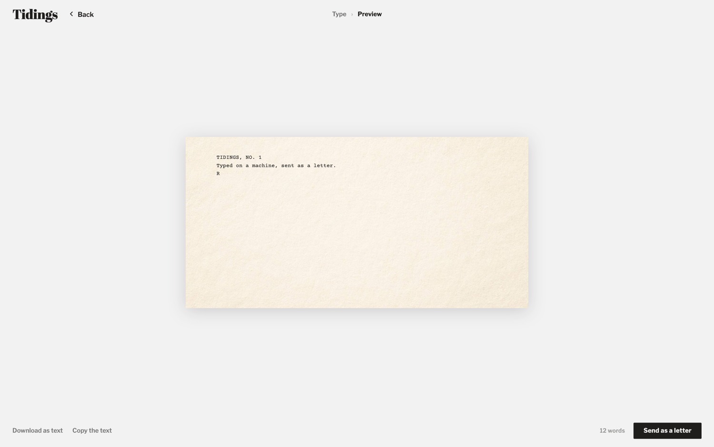

The page on its own, without the machine.

| Action | What it does |
|---|---|
| **Download as text** | Saves `tidings.txt` to your computer |
| **Copy the text** | Puts the text on your clipboard |
| **Send as a letter** | Carries the text to the writing screen, on cream letter paper |

> **Warning:** **Send as a letter** replaces the whole letter you have in
> progress — every sheet, both sides — with a single cream page holding the typed
> text. Stickers, photos and the envelope are kept. If the typed text is over 700
> words it is trimmed without warning. The machine sheet you chose doesn't travel
> with it.

---

## 13. Things to know before you rely on it

Honest limits of this version.

**Nothing is saved.** There's no autosave and no draft list. Refreshing the page,
closing the tab or pressing the browser's Back button out of the app loses the
letter — every sheet, both sides, the addresses and the typewriter text. Write it
in one sitting, or keep a copy elsewhere. **Download as text** on the typewriter
screen is the only way to get anything out of the app as a file.

**The link goes nowhere.** **Copy the link**, **WhatsApp**, **Mail** and
**Messages** all put the same fixed address on your clipboard — the same one for
every letter and every visitor. The send screen is the letter as your reader
*would* see it, on your own screen.

**Only the sheet you're looking at is shown on the Envelope and Send screens.**
If your letter runs to three sheets, the reader's view shows whichever one was
selected when you pressed Done, with no way to page through the rest.

**Overflowing writing is hidden, not moved.** Past the "Sheet full" point the
surplus text is simply invisible, and **Add a sheet** gives you a blank one — it
doesn't flow the overflow across.

**There's no undo for objects.** Ctrl/Cmd+Z undoes typing. Removing a sticker or
a photograph is final.

**Objects belong to the whole letter, not to a sheet.** Turn the sheet over, or
page to sheet 2, and the same stickers and the same photograph are still there.

**A diary still arrives in an envelope.** The envelope screen is skipped for a
diary, but the send screen still seals it inside the default cream envelope — so
you get an envelope you were never offered a chance to choose.

**It wants a desktop-sized window.** It works down to about 900 × 600. The sheet
scales with the window, so it gets smaller as the window does, and the step trail
hides itself at 820 pixels wide or narrower. It is not built for phones.

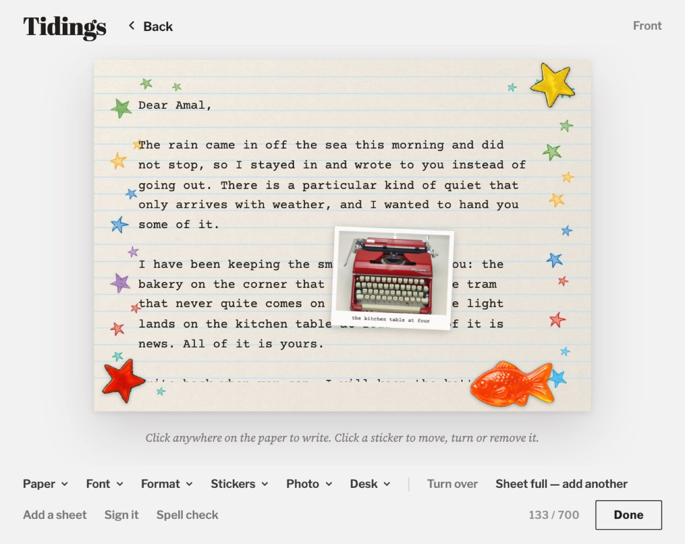

**No keyboard path to some controls.** The envelope colour dots, the stamps and
the handles on a selected object are mouse-only.

**Browser support.** The writing surface uses `contentEditable="plaintext-only"`,
which needs a current Chrome, Edge or Safari. Older Firefox won't let you type on
the paper.

---

## 14. Everything in the drawers

The full catalogue, in numbers.

| | How many |
|---|---|
| Letter papers | 18 |
| Diary books | 9 |
| Postcards | 11 |
| Envelopes | 10, plus "No envelope" |
| Wax seals for the envelope | 18, plus "No seal" |
| Sticker cut-outs | 115, in 7 trays |
| Typewriters | 8 |
| Sheets for the typewriter | 4 |
| Backdrops | 47 |
| Desk colours | 9, plus a colour wheel |
| Fonts | 40, in 5 groups |
| Letter templates | 8 |
| Photo shapes | 3 |
| Stamp countries | 4, three stamps each |

**The 18 letter papers:** cream · feint ruled · ivory · star paper · school page ·
kraft · roses · peanuts · ruled stars · crayon stars · pastel stars · gold stars ·
pink frame · gold border · bow card · thank you · yellow note · index card

**The 9 diary books:** dot grid · dot grid, ruled · lined · cream ruled · vintage ·
green book · red spiral · spiral pad · clipboard

**The 11 postcards:** cream · wide ruled · ivory · star paper · kraft · gold
border · gold stars · pastel stars · crayon stars · ruled stars · yellow

---

## 15. Toolbar reference

The bar along the bottom changes with the screen. Drawers on the left, words in
the middle, the count and the main button on the right.

### Screen 3 — writing

| Control | Type | What it does |
|---|---|---|
| Paper / Book | Drawer | The sheet you're writing on |
| Font | Drawer | The hand it's written in |
| Format | Drawer | Replace the text with a template |
| Stickers | Drawer | Seven trays of cut-outs |
| Photo | Drawer | Add a polaroid frame |
| Desk | Drawer | Colour, backdrop or your own picture |
| Turn over / Write on the back | Word | The other side of this sheet |
| Sheet full — add another | Word | Only when the writing overflows |
| Add a sheet | Word | A fresh sheet on the stack |
| Sign it / Remove signature | Word | The signature slot |
| Spell check | Word | Browser spell checking on or off |
| `133 / 700` | Counter | Words in the whole letter |
| **Done** | Button | To the envelope, or straight to Send for a diary |

### Screen 4 — the envelope

| Control | Type | What it does |
|---|---|---|
| Envelope | Drawer | Ten envelopes, or none |
| Seal | Drawer | Eighteen wax seals, or none — hidden when there's no envelope |
| Writing runs off this sheet — add another | Word | Only when the letter overflows. Goes back to writing, on a fresh sheet |
| Keep writing | Word | Back to the writing screen |
| Copy the link | Word | Copies the fixed address |
| **Send it** | Button | To the reader's view |

### Screen 5 — send

| Control | What it does |
|---|---|
| Writing runs off this sheet — add another | Only when the letter overflows. Back to writing, on a fresh sheet |
| Copy the link · WhatsApp · Mail · Messages | All copy the same fixed address to your clipboard |
| Seal it again | Closes the envelope so you can watch it open again |

### Screen 6 — the typewriter

| Control | Type | What it does |
|---|---|---|
| Machine | Drawer | Eight typewriters |
| Sheet | Drawer | Four papers for the platen |
| Format | Drawer | Replace the text with a template |
| Open a text file | Word | Load a `.txt` or `.md` |
| Spell check | Word | Browser spell checking |
| Send as a letter | Word | Carry the text to the writing screen |
| `11 words` | Counter | Words typed |
| **Done** | Button | To the typed page |

---

## 16. Mouse and keyboard

| Input | Where | What happens |
|---|---|---|
| Click the paper | Writing screen | Start writing at that spot |
| Double-click a word | Writing screen | Selects the word as usual |
| **Ctrl/Cmd + A** | Writing on the paper | Selects everything on that side, so you can type over it |
| **Ctrl/Cmd + Z** | Writing screen or typewriter | Undoes typing, including a template and click-and-type padding. Not objects |
| **Ctrl/Cmd + V** | Writing on the paper | Pastes, trimmed to fit the 700-word limit |
| Click an object | Writing screen | Selects it and shows its handles |
| Drag an object | Writing screen | Moves it |
| Drag the knob | Selected object | Turns it |
| **Shift** + drag the knob | Selected object | Turns in 15° steps |
| Drag the corner | Selected object | Resizes, 0.4× to 3× |
| **Delete** / **Backspace** | Object selected, not typing | Removes it |
| **Escape** | Object selected | Deselects |
| **Escape** | Drawer open | Closes the drawer |
| Drag a picture onto a frame | Photo or signature | Drops it in |
| Any letter key | Typewriter | Lights that key on the machine |
| Browser Back / Forward | Anywhere | Walks the screens |

> Pressing **Escape** with both a drawer open and an object selected closes the
> drawer only. Press it twice to do both.

---

## 17. For developers

### What it's built with

| | |
|---|---|
| Framework | React 18 |
| Build tool | Vite 5 |
| Language | Plain JavaScript with JSX — no TypeScript |
| Styling | Inline styles plus two CSS files of tokens and resets |
| Fonts | 40 Google Fonts, self-hosted: 39 through `@fontsource`, and Courier Prime from woff2 files in `src/assets/fonts/` |
| State | One React class component. No Redux, no router, no context |
| Dependencies | 44 declared: 40 fonts, React, React DOM, Vite, the React plugin |

### Running it

```bash
git clone https://github.com/Usman9374/Tidings.git
cd Tidings
npm install
npm run dev
```

Then open http://localhost:5173.

| Script | What it does |
|---|---|
| `npm run dev` | Dev server with hot reload |
| `npm run build` | Static build into `dist/` |
| `npm run preview` | Serves the built `dist/` |

### How the code is laid out

```
DOCUMENTATION.md      this file
README.md             engineering notes and the change log
docs/
  Tidings-Guide.docx  this guide as a Word document
  screenshots/        the pictures in this guide
  Tidings.docx        the original product brief
  Tidings.dc.html     the Claude Design canvas this was built from
public/
  assets/             the picture library — papers, envelopes, machines, cut-outs
  uploads/            the photographed papers and the 47 backdrops
src/
  main.jsx            mounts the app
  App.jsx             all state and every computed style
  data.js             the design tables — the whole stationery catalogue
  assets.js           turns a logical path into a served URL
  fonts.js            the 40 fonts, loading and fitting them
  fontFaces.js        the @font-face imports, loaded as its own chunk
  editing.js          caret maths for click-and-type
  components/
    Menu.jsx          a toolbar dropdown
    Transformable.jsx move, turn, resize, remove
    ImageSlot.jsx     a picture well
    ColorWheel.jsx    hue disc plus brightness
  screens/
    Header.jsx        wordmark, Back, step trail, status
    Chooser.jsx       screens 1 and 2
    Desk.jsx          screens 3, 4 and 5
    Typewriter.jsx    screens 6 and 7
    Toolbar.jsx       the bottom bar
    Menus.jsx         the dropdown panels
  styles/
    tokens.css        design tokens and @font-face
    app.css           reset, keyframes, hover states
```

### All the state lives in App.jsx

`App.jsx` holds every piece of state and computes every style. One method,
`renderVals()`, returns a single object — called `v` everywhere — and each screen
component reads what it needs from it and renders.

```jsx
// App.jsx
render() {
  const v = this.renderVals();
  return <div style={v.rootStyle}>
    <Header v={v} />
    <Desk v={v} />
    <Toolbar v={v} />
  </div>;
}
```

So the screens are presentational and hold nothing but short-lived interaction
state — whether a drawer is open, whether a drag is in progress. If you want to
change *what* the app does, you edit `App.jsx` or `data.js`. If you want to
change *how it looks*, you edit a screen.

### The three knobs on `App`

`App` takes three props, none of which `main.jsx` passes today, so each falls
back to its default:

| Prop | Default | What it does |
|---|---|---|
| `startScreen` | `1` | Which screen to open on — handy when working on screen 5 |
| `wordLimit` | `700` | The word cap for the whole letter |
| `letterInk` | `#201e1d` | The colour the letter is written in |

```jsx
// src/main.jsx — open straight onto the send screen with a bigger cap
<App startScreen={5} wordLimit={1200} />
```

### How pictures are served

The picture library — about 230 files, 26 MB — lives in `public/` at the exact
paths `data.js` refers to:

```js
{ id: 'roses', label: 'roses', img: 'assets/paper/p-roses.jpg', ... }
```

Nothing enters the module graph. `vite build` finishes in about a second, the
browser fetches only the handful of pictures an open drawer shows, and a new
sheet of paper is a file plus a line in a table.

`R()` in `src/assets.js` turns a logical path into a served URL, and passes
already-formed URLs (a dropped-in photo's `blob:`, a `data:` URI) straight
through.

### The geometry, in short

Every paper carries measurements taken off its own photograph:

```js
{
  id: 'notebook',
  img: 'uploads/tidings/page1.jpeg',
  aspect: 1.3699,          // height ÷ width
  maxW: 620,               // never wider than this, in px
  pad: [6.26, 7, 6, 14.5], // top, right, bottom, left — in % of the sheet's WIDTH
  lh: 3.1613,              // line height, same units
  fs: 2.15,                // font size, same units
  margin: 11.473,          // where the red margin rule is printed
  fit: 'fill',
}
```

Everything is in `cqw` — percent of the sheet's own width — so the whole sheet
scales as one piece and the writing never drifts off the printed rules.

Type never sets below 11px, however small the sheet gets. The printed rules have
a matching floor of their own, worked out from the same numbers, so when the type
stops shrinking the rules stop with it and the writing stays on the line.

---

## 18. Adding new stationery

Adding to the drawers is deliberately boring.

**A new sheet of paper**

1. Put the picture in `public/assets/paper/`.
2. Add a row to the right list in `src/data.js`:

```js
{ id: 'linen', label: 'linen', img: P + 'p-linen.jpg', aspect: 1.294, maxW: 620,
  pad: [11, 12, 10, 12], lh: 3.1, fs: 2.05, rule: 'none', fit: 'cover' },
```

Measure `aspect` from the picture, then open the app and nudge `pad`, `lh` and
`fs` until the writing sits where it should.

**A new sticker**

1. Put the cut-out in `public/assets/st/`.
2. Add it to a tray:

```js
GROUPS.charms.push(add('charm32', S + 'charm-32.png', 11, 'die-cut charm', 'charms'));
```

`11` is its width as a percentage of the sheet.

**A new envelope**

```js
{ id: 'sage', label: 'sage', img: E + 'env-sage.png', aspect: 1.21,
  addr: [14, 72, 40],   // left %, top %, width % — leave null for no address block
  stamp: [10, 50, 16],  // right %, top %, width %
  seal: [50, 70, 15] }, // left %, top %, width %
```

**A new typewriter** needs its key grid measured off the photograph — the rows,
the starting x, the pitch between keys. Copy an existing entry in `MACHINES` and
adjust it against the picture.

---

## 19. Building and deploying

```bash
npm run build
```

Emits `dist/` — about 32 MB, almost all of it pictures. The JavaScript is
roughly 233 KB, 73 KB gzipped.

The app is deployed on Vercel:

```bash
vercel --prod
```

Vercel detects Vite on its own — no configuration file needed. The live app is
at https://tidings-letters.vercel.app.

Pushing to GitHub does not deploy on its own. To make it automatic, connect the
GitHub repository from the Vercel dashboard.

---

## 20. Troubleshooting

**The pictures don't load in development.**
They're served from `public/`. Make sure you're running `npm run dev` from the
project root, and check that `public/assets/` actually has files in it.

**A font doesn't change the writing.**
Fonts load on demand. Picking one loads its files first and then restyles, so
there's a beat before the letter changes. If it never changes, check the network
tab for a blocked font request.

**I can't type on the paper.**
The writing surface needs a browser that supports
`contentEditable="plaintext-only"` — current Chrome, Edge or Safari. Older
Firefox won't work.

**The typewriter keys light up but nothing is typed.**
Click the paper in the machine first. The key glow listens to the whole window,
but the typing goes wherever the cursor is.

**My backdrop picture didn't appear.**
It has to be at least 1280 × 720. The Desk drawer shows a note with the size you
offered when it refuses one.

**My letter disappeared.**
Nothing is saved between page loads. A refresh starts a new letter.

**"Sheet full — add another" appears the moment I arrive.**
The app starts with a sample letter in it, and on a small or wide paper that
sample already overflows. Pick a taller paper, or clear the text.

**The step trail is missing.**
It hides itself on windows 820 pixels wide or narrower. The Back button still
works.
